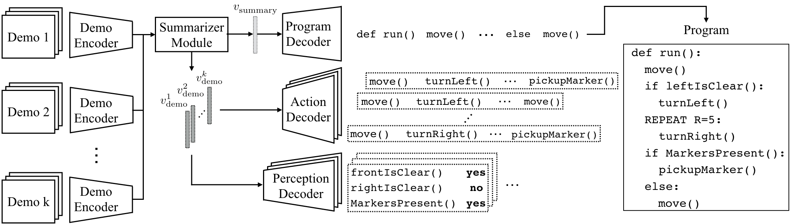
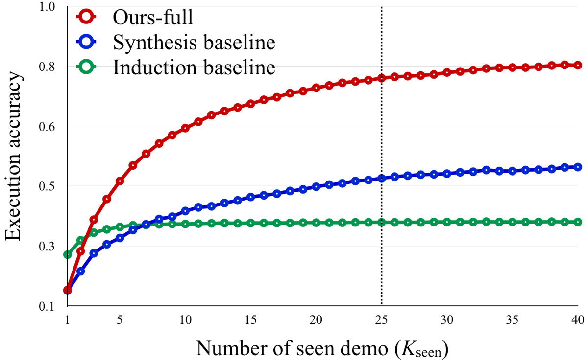

# Neural Program Synthesis from Diverse Demonstration Videos (Demo2Program)

## Descriptions
This project is a [TensorFlow](https://www.tensorflow.org/) implementation of [**Neural Program Synthesis from Diverse Demonstration Videos**](https://shaohua0116.github.io/demo2program/), which is published in ICML 2018. As interpreting decision making logic in demonstration videos is key to collaborating with and mimicking humans, our goal is to empower machines with this ability. To this end, we propose a neural program synthesizer that is able to explicitly synthesize underlying programs from behaviorally diverse and visually complicated demonstration videos, as illustrated in the following figure.

<p align="center">
    
</p>

We introduce a summarizer module as part of our model to improve the network’s ability to integrate multiple demonstrations varying in behavior. We also employ a multi-task objective to encourage the model to learn meaningful intermediate representations for end-to-end training. Our proposed model consists three components:
- **Demonstration Encoder** receives a demonstration video as input and produces an embedding that captures an agent’s actions and perception.
- **Summarizer Module** discovers and summarizes where actions diverge between demonstrations and upon which branching conditions subsequent actions are taken.
- **Program Decoder** represents the summarized understanding of demonstrations as a code sequence.

The illustration of the overall architecture is as follows. For more details, please refer to the paper.

<p align="center">
    
</p>

Our method is evaluated on a fully observable, third-person environment (Karel environment) and a partially observable, egocentric game (ViZDoom environment). We show that our model is able to reliably synthesize underlying programs as well as capture diverse behaviors exhibited in demonstrations.

\*This code is still being developed and subject to change.

## Directories
The structure of the repository:
- **./**: training and evaluation scripts
- **./models**: network models used for the experiments
- **./karel_env**: karel environment including dsl, interpreter and dataset generator / loader
- **./vizdoom_env**: vizdoom environment including dsl, interpreter and dataset generator / loader

## Prerequisites

- Python 2.7
- [Tensorflow 1.3.0](https://github.com/tensorflow/tensorflow/tree/r1.0)
- [SciPy](http://www.scipy.org/install.html)
- [NumPy](http://www.numpy.org/)
- [colorlog](https://pypi.python.org/pypi/colorlog)
- [cv2](https://pypi.python.org/pypi/opencv-python)
- [h5py](http://docs.h5py.org/en/latest/build.html#install)
- [Pillow](https://pillow.readthedocs.io/en/latest/installation.html#basic-installation)
- [progressbar](https://pypi.python.org/pypi/progressbar2)
- [ply](http://www.dabeaz.com/ply/)
- [ViZDoom Deterministic](https://github.com/HyeonwooNoh/ViZDoomDeterministic)

## Datasets

### Karel environment
- You can find the codes for the Karel environments in [this directory](./karel_env)
- To generate a dataset for Karel environments including programs and demonstrations, use the following script.
```bash
./karel_env/generate_dataset.sh
```
Default arguments are identical to the settings described in the paper.

### ViZDoom environment
- To reproduce experiments in our paper, you need to install our [deterministic ViZDoom envrionment](https://github.com/HyeonwooNoh/ViZDoomDeterministic)
- You can find the codes for the ViZDoom environments and detailed instructions in [this directory](./vizdoom_env)
- To generate a dataset (vizdoom_dataset, vizdoom_dataset_ifelse) for the ViZDoom environment including programs and demonstrations, use the following script.
```bash
./vizdoom_env/generate_dataset.sh
```

## Usage
### Training
- Train the full model (with the summarizer module and the multi-task objective)
```bath
python trainer.py --model full --dataset_path /path/to/the/dataset/ --dataset_type [karel/vizdoom]
```

- Train the summarizer model (with the summarizer module but without multi-task objective)
```bath
python trainer.py --model summarizer --dataset_path /path/to/the/dataset/ --dataset_type [karel/vizdoom]
```

- Train the baseline program synthesis model (without the summarizer module and multi-task objective)
```bath
python trainer.py --model synthesis_baseline --dataset_path /path/to/the/dataset/ --dataset_type [karel/vizdoom]
```

- Train the baseline program induction model
```bath
python trainer.py --model induction_baseline --dataset_path /path/to/the/dataset/ --dataset_type [karel/vizdoom]
```

- Arguments
    - --debug: set to `True` to see debugging visualization (LSTM masks, etc.)
    - --prefix: a nickanme for the training
    - --model: specify which type of models to train/test
    - --dataset\_type: choose between `karel` and `vizdoom`. You can also add your own datasets.
    - --dataset\_path: specify the path to the dataset where you can find a HDF5 file and a .txt file
    - --checkpoint: specify the path to a pre-trained checkpoint
    - Logging
        - --log\_setp: the frequency of outputing log info ([train step  681] Loss: 0.51319 (1.896 sec/batch, 16.878 instances/sec))
        - --write\_summary\_step: the frequency of writing TensorBoard sumamries (default 100)
        - --test\_sample\_step: the frequency of performing testing inference during training (default 100)
    - Hyperparameters
        - --num\_k: the number of seen demonstrations (default 10)
        - --batch\_size: the mini-batch size (default 32)
        - --learning\_rate: the learning rate (default 1e-3)
        - --lr\_weight\_decay: set to `True` to perform expotential weight decay on the learning rate
        - --scheduled\_sampling: set to `True` to train models with [scheduled sampling](https://arxiv.org/abs/1506.03099)
    - Architecture
        - --encoder\_rnn\_type: the recurrent model of the demonstration encoder. Choices include RNN, GRU, and LSTM
        - --num\_lstm\_cell\_units: the size of RNN/GRU/LSTM hidden layers (default 512)
        - --demo\_aggregation: how to aggregate the demo features (default average pooling) for synthesis and induction baseline

### Testing
- Evalute trained models
```bash
python evaler.py --dataset_path /path/to/the/dataset/ --dataset_type [karel/vizdoom] [--train_dir /path/to/the/training/dir/ OR --checkpoint /path/to/the/trained/model]
```

## Results

### Karel environment

| Methods                        | Execution | Program | Sequence |
| ------------------------------ | :-------: | :-----: | :------: |
| Induction baseline             |   62.8%   |    -    |    -     |
| Synthesis baseline             |   64.1%   |  42.4%  |  35.7%   |
| + summarizer (ours)            |   68.6%   |  45.3%  |  38.3%   |
| +  multi-task loss (ours-full) |   72.1%   |  48.9%  |  41.0%   |

- Effect of the summarizer module

To verify the effectiveness of our proposed summarizer module, we conduct experiments where models are trained on varying numbers of demonstrations (k) and compare the execution accuracy.

| Methods             |  k=3  |  k=5  | k=10  |
| ------------------- | :---: | :---: | :---: |
| Synthesis baseline  | 58.5% | 60.1% | 64.1% |
| + summarizer (ours) | 60.6% | 63.1% | 68.6% |

### ViZDoom environment

| Methods            | Execution | Program | Sequence |
| ------------------ | :-------: | :-----: | :------: |
| Induction baseline |   35.1%   |    -    |    -     |
| Synthesis baseline |   48.2%   |  39.9%  |  33.1%   |
| Ours-full          |   78.4%   |  62.5%  |  53.2%   |

- If-else experiment: 

To verify the importance of inferring underlying conditions, we perform evaluation only with programs containing a single if-else statement with two branching consequences. This setting is sufficiently simple to isolate other diverse factors that might affect the evaluation result.

| Methods            | Execution | Program | Sequence |
| ------------------ | :-------: | :-----: | :------: |
| Induction baseline |   26.5%   |    -    |    -     |
| Synthesis baseline |   59.9%   |  44.4%  |  36.1%   |
| Ours-full          |   89.4%   |  69.1%  |  58.8%   |

- Generalization over different number of seen demonstrations

The baseline models and our model trained with 25 seen demonstration are evaluated with fewer or more seen demonstrations.

<p align="center">
    
</p> 

## Related work

* [Leveraging Grammar and Reinforcement Learning for Neural Program Synthesis](https://openreview.net/forum?id=H1Xw62kRZ) in ICLR 2018
* [RobustFill: Neural Program Learning under Noisy I/O](https://arxiv.org/abs/1703.07469) in ICML 2017
* [DeepCoder: Learning to Write Programs](https://arxiv.org/abs/1611.01989) in ICLR 2017
* [Neuro-Symbolic Program Synthesis](https://arxiv.org/abs/1611.01855) in ICLR 2017
* [One-Shot Imitation Learning](https://arxiv.org/abs/1703.07326) in NIPS 2017
* [One-Shot Visual Imitation Learning via Meta-Learning](https://arxiv.org/abs/1709.04905) in CoRL 2017
* [Awesome Neural Programming](https://github.com/andrewliao11/awesome-neural-programming)

## Cite the paper
If you find this useful, please cite
```
@inproceedings{sun2018neural,
    title = {Neural Program Synthesis from Diverse Demonstration Videos},
    author = {Shao-Hua Sun and Hyeonwoo Noh and Sriram Somasundaram and Joseph J Lim},
    booktitle = {Proceedings of the 35th International Conference on Machine Learning},
    year = {2018},
}
```

## Authors
[Shao-Hua Sun](http://shaohua0116.github.io/)\*, [Hyeonwoo Noh](http://cvlab.postech.ac.kr/~hyeonwoonoh/)\*, [Sriram Somasundaram](http://srirams32.github.io/), and [Joseph J. Lim](http://www-bcf.usc.edu/~limjj/)

(\*Equal contribution)
